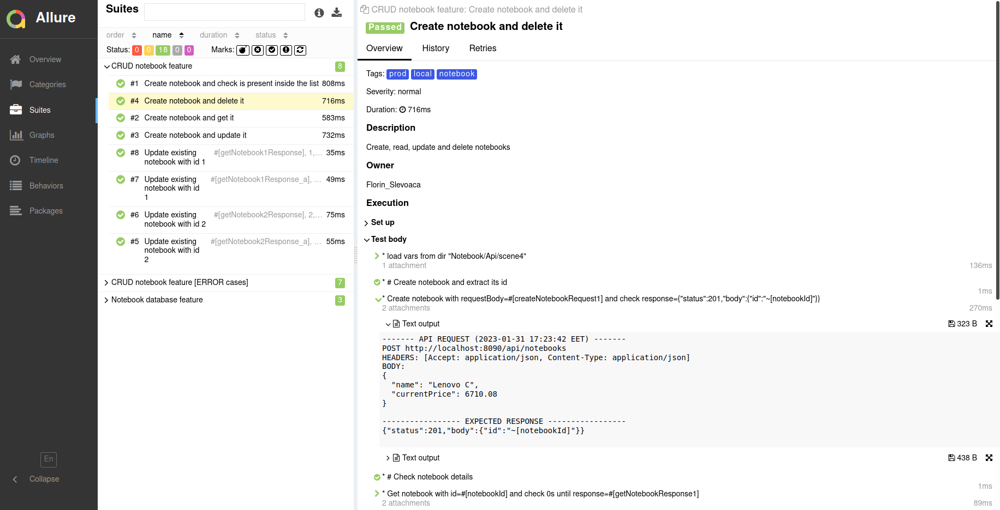

# Cucumber JUtils tutorial


A light tutorial on how to use [**cucumber-jutils**](https://github.com/fslev/cucumber-jutils) library  while testing a notebook manager web application.  

## Requirements
JDK11, Maven, Docker & docker-compose 

## Setup
_Start notebook-manager app:_
```shell
src/test/resources/docker

docker-compose up
```

Notebook manager Swagger:  
http://localhost:8090/swagger-ui.html  

_Run tests from Maven:_
```shell
mvn clean -Plocal,allure-reports verify
```
Check for Cucumber Allure reports inside `target/site/allure-maven-plugin/index.html`  

